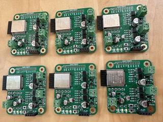
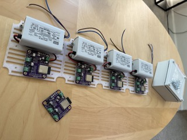
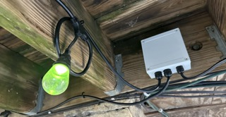
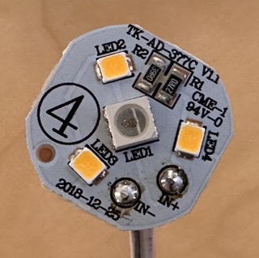
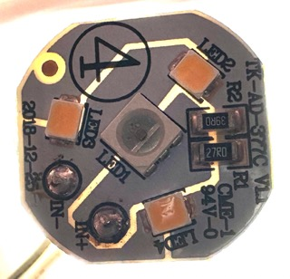
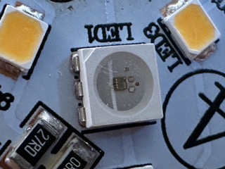

# kbx's String Lights Controller with ESP32 <!-- omit in toc -->

This repository contains [KiCad](https://kicad.org) project files for a PCB which can control RGB/W (patio) [string lights I bought from Amazon](https://a.co/d/7NtrBNi).

The LEDs used in these strings are unique in that there is **no dedicated data wire** via which data is sent to the addressable RGB LEDs the string consists of.

I've posted a short [video](https://youtu.be/82iJrEUkA1w) demo of the controller/lights in action on [YouTube](https://youtube.com).

## Table of Contents  <!-- omit in toc -->
- [Overview](#overview)
- [The Signal](#the-signal)
- [The ESPHome Configuration](#the-esphome-configuration)
- [The Box](#the-box)
- [The Question](#the-question)
- [Legal stuff and License](#legal-stuff-and-license)

## Overview

These string lights consist of LED bulbs which contain both an addressable RGB LED as well as ordinary white LEDs. A 433 MHz wireless handheld remote is provided for control of color, intensity, etc. One day, one of my strings went completely dead; I already had a desire to make these work directly within [Home Assistant](https://www.home-assistant.io) and so now this project exists.

The LEDs used in these strings are unique in that there is _no dedicated data wire_ via which data is sent to the addressable RGB LEDs the string consists of; each bulb has only/exactly two electrical contacts and all of the bulbs are electrically connected in parallel.

They can operate in one of two modes: RGB or white-only.

In RGB mode, data is sent by way of toggling the 5-volt supply between 5 volts and 2.5 volts; specific timing is used to differentiate between a logical `0` and `1`, similar to WS281x LEDs.

In white mode, the polarity of the power supply to the bulbs in the string is reversed, deactivating the RGB LED and instead lighting up the white LEDs. In this mode, simple PWM is then used to dim the white LEDs.

Given that the polarity of the power supply to the bulbs is used to determine the mode (RGB vs. white), it is not possible to use both the white and RGB modes simultaneously.

## The Signal

Because there is no dedicated data wire and because all of the LEDs are electrically connected in parallel, these LEDs are "pre-addressed", meaning each one is (somehow) assigned a number that is (permanently?) embedded in the LED. (It may be possible to change this address but I can't seem to find any specific documentation for these LEDs.)

The structure of the data sent to these particular LEDs is quite simple. It consists of:

- A 3-bit header identifying which LED address the RGB data that follows is for
- 24 bits containing the RGB values for the LED address indicated by the header (above):
  - Eight bits for green
  - Eight bits for red
  - Eight bits for blue

These specific strings (as linked above) are shipped with LEDs that have one of four addresses (0, 1, 2 or 3); with four addresses on the line, a complete transmission (to update all RGB LEDs in the string) consists of four 27-bit packets (as described above).

## The ESPHome Configuration

Given the complexity of operating these LED bulbs, I needed a custom ESPHome component to control/drive the electronics necessary to operate them -- attempting to operate them manually by way of switches is actually dangerous as [the H-bridge configuration](StringLightsController.pdf) can produce in a direct short across the power supply. They're not useful if the magic smoke comes out.

I've created a repository for my [ESPHome custom/external components](https://github.com/kbx81/esphome_custom_components). Specifically, the [`dop_led_plus_h_bridge`](https://github.com/kbx81/esphome_custom_components/tree/main/components/dop_led_plus_h_bridge) external component exists for just this purpose/project. If you take the time to build one (or more) of these PCBs, I highly recommend using it!

As for ESPHome configuration for these, I've created a separate repository for my [ESPHome](https://esphome.io) [configurations](https://github.com/kbx81/esphome-configs); the specific configuration I'm using with this board is [here](https://github.com/kbx81/esphome-configs/blob/c437e0f0ec9d37ab05d2a22e129756eb35faa67d/shared/esp-lights-string-base.yaml) and I'll also point you more directly to the `dop_led_plus_h_bridge` configuration within that file [here](https://github.com/kbx81/esphome-configs/blob/c437e0f0ec9d37ab05d2a22e129756eb35faa67d/shared/esp-lights-string-base.yaml#L468-L481).

## The Box

Any real project needs an enclosure. I drew up a simple [mounting plate](StringLightsPSUMountingPlate.3mf) to securely hold the PCB and power supply inside of a BUD Industries `PIP-11767` IP-67 enclosure which I also got from [Amazon](https://www.amazon.com/gp/product/B00OG1X29U/). Add some [cable glands](https://www.amazon.com/gp/product/B06Y5HXP2H/) to route the cables in/out of the enclosure and you've got a wonderful little control box that uses [ESPHome](https://esphome.io) and [Home Assistant](https://www.home-assistant.io) to operate these strings of lights!

## The Question

This is what's inside of one of these LED bulbs:

Where on Earth do these particular RGB LEDs come from??? I'm not aware of any sellers and a bit of searching around the 'net has revealed no sources. If you happen to know where to source these, please let me know! I'd be quite interested to pick some up to play with, especially if I could get LEDs with more than four addresses and/or get some real documentation on them.

## Legal stuff and License

Everything you see here is provided to you free of charge. You are free to use it however you please within the constraints of the license -- but you do so at your own risk.

The contents of this repository are licensed under the [Creative Commons Attribution-ShareAlike 4.0 International License](http://creativecommons.org/licenses/by-sa/4.0/).

_Thanks for visiting!_